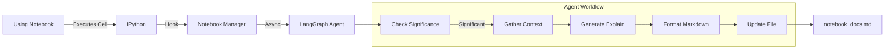

# 🤖 Jupyter Notebook Auto-Documentation Agent

> **"Code that documents itself."** 
> An intelligent background agent that watches your Jupyter Notebook executions and automatically generates explanatory documentation using LangGraph and Vercel AI Gateway.

---

## ✨ Features

- **Automated Documentation**: Generates a parallel `_docs.md` file for every notebook you run.
- **Context-Aware**: Uses information from previous cells to understand the flow of your code.
- **Significance Filtering**: Smartly ignores trivial cells (imports, prints, magic commands) to focus on the logic.
- **Background Processing**: Runs asynchronously so it never blocks your execution flow.
- **AI-Powered**: Leverages **Mistral Devstral 2** (via Vercel AI Gateway) for concise, expert-level explanations.
- **LangGraph Workflow**: Built on a robust state machine architecture for reliable agentic behavior.

## 🏗️ Architecture



## 🚀 Getting Started

### Prerequisites

- Python 3.9+
- [Jupyter Notebook](https://jupyter.org/) or JupyterLab
- Vercel AI Gateway API Key

### Installation

1. **Clone the repository**
   ```bash
   git clone https://github.com/yourusername/notebook-agent.git
   cd notebook-agent
   ```

2. **Install Dependencies**
   We recommend using [uv](https://github.com/astral-sh/uv) for speed, but pip works too.

   ```bash
   # Using uv
   uv venv
   source .venv/bin/activate  # or .\.venv\Scripts\activate on Windows
   uv pip install -r requirements.txt

   # Using pip
   python -m venv venv
   source venv/bin/activate
   pip install -r requirements.txt
   ```

3. **Configure Environment**
   Create a `.env` file in the root directory:
   ```env
   VERCEL_AI_GATEWAY_URL=https://gateway.ai.vercel.sh/v1
   VERCEL_AI_GATEWAY_API_KEY=your_key_here
   MODEL_NAME=mistral/devstral-2
   ```

4. **Install the Startup Script** (Crucial Step!)
   This registers the agent with your local Jupyter environment.
   ```bash
   # Find your IPython startup folder
   python -c "import IPython; print(IPython.paths.get_ipython_dir())"
   
   # Copy the script (Adjust source path if needed)
   cp startup/00_notebook_docs.py ~/.ipython/profile_default/startup/
   ```

## 💡 Usage

Just use Jupyter as you normally would!

1. Start Jupyter: `jupyter notebook`
2. Create or open a notebook.
3. Run a significant cell (e.g., a function definition or data processing step).
4. Watch as a file named `[notebook_name]_docs.md` appears next to your notebook, populating with explanations in real-time.

## 🛠️ Tech Stack

- **[LangGraph](https://langchain-ai.github.io/langgraph/)**: For agent orchestration and state management.
- **[Vercel AI SDK](https://sdk.vercel.ai/docs)**: For unified model access.
- **IPython**: For hooking into the execution lifecycle.
- **Pydantic**: For robust configuration and data validation.

## 📄 License

MIT
