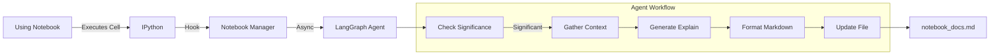

# 🤖 Jupyter Notebook Auto-Documentation Agent

> **"Code that documents itself."** 
> An intelligent background agent that watches your Jupyter Notebook executions and automatically generates explanatory documentation using LangGraph. Works with any OpenAI-compatible API — OpenAI, Groq, Ollama, Vercel AI Gateway, and more.

---

## ✨ Features

- **Automated Documentation**: Generates a parallel `_docs.md` file for every notebook you run.
- **Context-Aware**: Uses information from previous cells to understand the flow of your code.
- **Significance Filtering**: Smartly ignores trivial cells (imports, prints, magic commands) to focus on the logic.
- **Background Processing**: Runs asynchronously so it never blocks your execution flow.
- **AI-Powered**: Leverages any LLM via any OpenAI-compatible API for concise, expert-level explanations.
- **Provider Flexible**: Works out of the box with OpenAI, Groq, Ollama, Vercel AI Gateway, LM Studio, Together AI, and more.
- **LangGraph Workflow**: Built on a robust state machine architecture for reliable agentic behavior.

## 🏗️ Architecture


```mermaid
graph LR
    User[Using Notebook] -->|Executes Cell| IPython
    IPython -->|Hook| Manager[Notebook Manager]
    Manager -->|Async| Agent[LangGraph Agent]
    
    subgraph "Agent Workflow"
        Check[Check Significance] -->|Significant| Context[Gather Context]
        Context --> Explain[Generate Explain]
        Explain --> Format[Format Markdown]
        Format --> Save[Update File]
    end
    
    Agent --> Check
    Save --> Docs[notebook_docs.md]
```

## 🚀 Getting Started

### Prerequisites

- Python 3.9+
- [Jupyter Notebook](https://jupyter.org/) or JupyterLab
- An API key from any OpenAI-compatible provider (see [Provider Setup](#-provider-setup) below)

### Installation

1. **Clone the repository**
   ```bash
   git clone https://github.com/yourusername/notebook-agent.git
   cd notebook-agent
   ```

2. **Install Dependencies**
   We recommend using [uv](https://github.com/astral-sh/uv) for speed, but pip works too.

   ```bash
   # Using uv
   uv venv
   source .venv/bin/activate  # or .\.venv\Scripts\activate on Windows
   uv pip install -r requirements.txt

   # Using pip
   python -m venv venv
   source venv/bin/activate
   pip install -r requirements.txt
   ```

3. **Configure Environment**
   Copy `.env.example` to `.env` and fill in your values:
   ```bash
   cp .env.example .env
   ```
   The key variables to set:
   ```env
   # Your AI provider (see Provider Setup below for all options)
   VERCEL_AI_GATEWAY_URL=https://api.openai.com/v1
   VERCEL_AI_GATEWAY_API_KEY=your_key_here
   MODEL_NAME=gpt-4o-mini

   # IMPORTANT: Absolute path to this cloned repo on your machine
   NOTEBOOK_AGENT_PATH=/path/to/Notebook_Agent
   ```

4. **Install the Startup Script** (Crucial Step!)
   This registers the agent with your local Jupyter environment.
   ```bash
   # Find your IPython startup folder
   python -c "import IPython; print(IPython.paths.get_ipython_dir())"
   
   # Copy the script (Adjust source path if needed)
   cp startup/00_notebook_docs.py ~/.ipython/profile_default/startup/
   ```
   > **Note:** The startup script reads `NOTEBOOK_AGENT_PATH` from your `.env` to locate the project. Make sure this is set before launching Jupyter.

## 💡 Usage

Just use Jupyter as you normally would!

1. Start Jupyter: `jupyter notebook`
2. Create or open a notebook.
3. Run a significant cell (e.g., a function definition or data processing step).
4. Watch as a file named `[notebook_name]_docs.md` appears next to your notebook, populating with explanations in real-time.

## 🔌 Provider Setup

This project was built using **Vercel AI Gateway** with **Mistral Devstral 2**, but you're free to use any provider you like. The agent uses the OpenAI SDK under the hood, so it works with **any provider that exposes an OpenAI-compatible endpoint**. Just set three env vars in your `.env` file:

| Provider | `VERCEL_AI_GATEWAY_URL` | `VERCEL_AI_GATEWAY_API_KEY` | `MODEL_NAME` |
|----------|------------------------|-----------------------------|--------------|
| **OpenAI** | `https://api.openai.com/v1` | Your OpenAI key | `gpt-4o-mini` |
| **Groq** | `https://api.groq.com/openai/v1` | Your Groq key | `llama-3.3-70b-versatile` |
| **Ollama** (local) | `http://localhost:11434/v1` | `ollama` | `llama3.2` |
| **Vercel AI Gateway** | `https://gateway.ai.vercel.sh/v1` | Your Vercel key | `mistral/devstral-2` |
| **LM Studio** (local) | `http://localhost:1234/v1` | `lm-studio` | `your-loaded-model` |
| **Together AI** | `https://api.together.xyz/v1` | Your Together key | `meta-llama/Llama-3-70b-chat-hf` |

<details>
<summary><b>Example: Using Groq (free tier available)</b></summary>

```env
VERCEL_AI_GATEWAY_URL=https://api.groq.com/openai/v1
VERCEL_AI_GATEWAY_API_KEY=gsk_your_groq_key_here
MODEL_NAME=llama-3.3-70b-versatile
```
</details>

<details>
<summary><b>Example: Using Ollama (100% local, no API key needed)</b></summary>

```bash
# First, pull a model
ollama pull llama3.2
```
```env
VERCEL_AI_GATEWAY_URL=http://localhost:11434/v1
VERCEL_AI_GATEWAY_API_KEY=ollama
MODEL_NAME=llama3.2
```
</details>

## 🛠️ Tech Stack

- **[LangGraph](https://langchain-ai.github.io/langgraph/)**: For agent orchestration and state management.
- **[OpenAI SDK](https://github.com/openai/openai-python)**: For unified model access (works with any OpenAI-compatible API).
- **IPython**: For hooking into the execution lifecycle.
- **Pydantic**: For robust configuration and data validation.

## 📄 License

MIT
