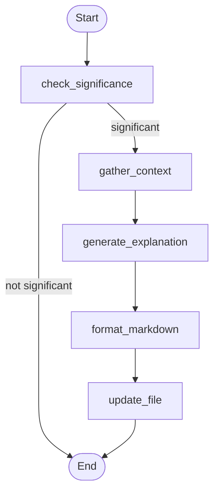
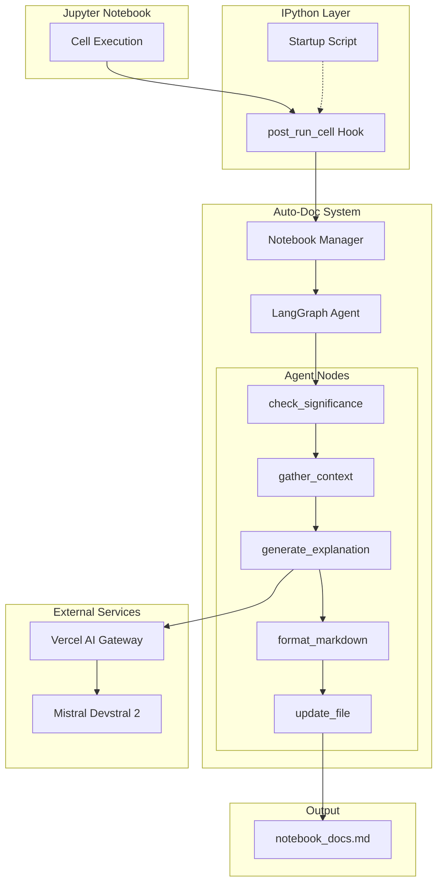

# Jupyter Notebook Auto-Documentation System

Automatic code documentation system that analyzes Jupyter notebook cell executions and generates explanatory markdown documentation using LangGraph agents and Vercel AI Gateway with Mistral Devstral 2.

## User Review Required

> [!IMPORTANT]
> **Vercel AI Gateway Configuration**: You'll need to set up a Vercel AI Gateway endpoint with Mistral as the provider and have access to Devstral 2. Please confirm you have these credentials ready.

> [!WARNING]
> **IPython Startup Script Location**: The system will install a startup script in `~/.ipython/profile_default/startup/`. This will affect ALL Jupyter notebooks on your system. Confirm this is acceptable.

---

## Proposed Changes

### Project File Structure

```
Notebook_Agent/
├── src/
│   ├── __init__.py
│   ├── agent/                    # LangGraph Agent
│   │   ├── __init__.py
│   │   ├── state.py              # Agent state definition
│   │   ├── nodes.py              # Node implementations
│   │   └── graph.py              # Graph compilation
│   ├── manager/                  # Notebook Manager
│   │   ├── __init__.py
│   │   └── notebook_manager.py   # Multi-notebook tracking
│   ├── utils/                    # Utilities
│   │   ├── __init__.py
│   │   ├── significance.py       # Cell significance checker
│   │   ├── file_ops.py           # Markdown file operations
│   │   └── context.py            # Context gathering utilities
│   └── config/                   # Configuration
│       ├── __init__.py
│       └── settings.py           # API keys, settings
├── startup/
│   └── 00_notebook_docs.py       # IPython startup script
├── tests/
│   ├── __init__.py
│   ├── test_significance.py      # Significance filter tests
│   ├── test_nodes.py             # Node unit tests
│   ├── test_agent.py             # Agent integration tests  
│   └── test_manager.py           # Manager tests
├── .env.example                  # Environment template
├── requirements.txt              # Dependencies
├── setup.py                      # Package setup
└── README.md                     # Setup instructions
```

---

### Configuration Layer

> [!NOTE]
> See [ai_sdk_v6_notes.md](file:///d:/NextJs%20Projects/Notebook_Agent/ai_sdk_v6_notes.md#python-usage-openai-sdk-compatibility) for detailed Vercel AI Gateway Python usage patterns.

#### [NEW] [.env.example](file:///d:/NextJs%20Projects/Notebook_Agent/.env.example)

Environment template with required API credentials:
- `VERCEL_AI_GATEWAY_URL` - Vercel AI Gateway endpoint (e.g., `https://gateway.ai.vercel.sh/v1`)
- `VERCEL_AI_GATEWAY_API_KEY` - Your Vercel API key or provider key

#### [NEW] [settings.py](file:///d:/NextJs%20Projects/Notebook_Agent/src/config/settings.py)

Configuration management using `pydantic-settings`:
- Load environment variables
- Define model name (`mistral/devstral-2`), temperature (0.7), max tokens
- Validate required fields on startup

---

### LangGraph Agent

#### [NEW] [state.py](file:///d:/NextJs%20Projects/Notebook_Agent/src/agent/state.py)

Agent state using `TypedDict`:

```python
from typing import TypedDict, Optional, List

class CellInfo(TypedDict):
    code: str
    output: Optional[str]
    execution_count: int

class AgentState(TypedDict):
    # Current cell information
    current_cell: CellInfo
    notebook_name: str
    notebook_path: str
    
    # Context from previous cells
    previous_cells: List[CellInfo]
    
    # Processing flags
    is_significant: bool
    skip_reason: Optional[str]
    
    # Generated content
    explanation: Optional[str]
    formatted_markdown: Optional[str]
    
    # File tracking
    docs_filepath: str
    current_docs_content: Optional[str]
```

#### [NEW] [nodes.py](file:///d:/NextJs%20Projects/Notebook_Agent/src/agent/nodes.py)

Five node implementations:

| Node | Purpose | Logic |
|------|---------|-------|
| `check_significance` | Filter trivial cells | Skip empty cells, import-only, single print statements, magic commands |
| `gather_context` | Collect previous cells | Retrieve last 3-5 cells for contextual understanding |
| `generate_explanation` | Call AI API | Use `AsyncOpenAI` with Vercel AI Gateway → Mistral Devstral 2 (see [ai_sdk_v6_notes.md](file:///d:/NextJs%20Projects/Notebook_Agent/ai_sdk_v6_notes.md)) |
| `format_markdown` | Structure output | Create well-formatted markdown section with heading, code block, explanation |
| `update_file` | Append to docs | Append formatted content to `[notebook]_docs.md` |

**Significance Rules** (in `check_significance`):
- ❌ Empty cells or whitespace only
- ❌ Only `import` statements (no logic)
- ❌ Single `print()` statements
- ❌ Magic commands (`%matplotlib`, `!pip`, etc.)
- ❌ Cell is a comment-only
- ✅ Variable assignments with computations
- ✅ Function/class definitions
- ✅ Data transformations
- ✅ API calls, ML operations

#### [NEW] [graph.py](file:///d:/NextJs%20Projects/Notebook_Agent/src/agent/graph.py)

LangGraph workflow definition:



Uses conditional edge after `check_significance` to short-circuit insignificant cells.

---

### Notebook Manager

#### [NEW] [notebook_manager.py](file:///d:/NextJs%20Projects/Notebook_Agent/src/manager/notebook_manager.py)

Singleton manager for tracking multiple notebooks:

```python
class NotebookManager:
    _instance = None
    _agents: Dict[str, CompiledStateGraph]  # notebook_path -> agent
    _cell_history: Dict[str, List[CellInfo]]  # notebook_path -> cells
    
    @classmethod
    def get_instance(cls) -> 'NotebookManager':
        """Singleton access"""
        
    def get_or_create_agent(self, notebook_path: str) -> CompiledStateGraph:
        """Lazy initialization per notebook"""
        
    def record_cell(self, notebook_path: str, cell: CellInfo) -> None:
        """Track cell for context"""
        
    def get_recent_cells(self, notebook_path: str, n: int = 5) -> List[CellInfo]:
        """Retrieve context"""
        
    def cleanup_notebook(self, notebook_path: str) -> None:
        """Clean up on notebook close"""
```

---

### Utility Functions

#### [NEW] [significance.py](file:///d:/NextJs%20Projects/Notebook_Agent/src/utils/significance.py)

```python
def is_significant_cell(code: str) -> tuple[bool, Optional[str]]:
    """
    Analyze if cell warrants documentation.
    Returns (is_significant, skip_reason)
    """
```

Pattern matching for:
- Import-only detection via regex
- Magic command detection (`%`, `!`, `%%`)
- Print-only detection
- Empty/whitespace check
- Comment-only detection

#### [NEW] [file_ops.py](file:///d:/NextJs%20Projects/Notebook_Agent/src/utils/file_ops.py)

```python
def get_docs_filepath(notebook_path: str) -> str:
    """Convert notebook.ipynb → notebook_docs.md"""

def read_current_docs(filepath: str) -> str:
    """Read existing docs or return empty"""

def append_to_docs(filepath: str, content: str) -> None:
    """Safely append with file locking"""
    
def initialize_docs_file(filepath: str, notebook_name: str) -> None:
    """Create docs file with header if not exists"""
```

#### [NEW] [context.py](file:///d:/NextJs%20Projects/Notebook_Agent/src/utils/context.py)

```python
def format_context_for_prompt(cells: List[CellInfo]) -> str:
    """Format previous cells for LLM context"""
```

---

### IPython Integration

#### [NEW] [00_notebook_docs.py](file:///d:/NextJs%20Projects/Notebook_Agent/startup/00_notebook_docs.py)

IPython startup script that:

1. **Detects Environment**: Only activates in Jupyter (not plain IPython)
2. **Registers Hook**: Uses `post_run_cell` event
3. **Extracts Notebook Path**: From `__session__` or kernel connection file
4. **Handles Errors**: Only processes successful executions (`result.success`)
5. **Invokes Agent**: Passes cell info to NotebookManager

```python
def post_run_cell_hook(result):
    """Called after each cell execution"""
    if not result.success:
        return  # Skip failed cells
    
    # Get notebook info
    notebook_path = get_notebook_path()
    
    # Extract cell info
    cell_info = {
        'code': result.info.raw_cell,
        'output': get_cell_output(result),
        'execution_count': get_ipython().execution_count
    }
    
    # Process asynchronously
    manager = NotebookManager.get_instance()
    agent = manager.get_or_create_agent(notebook_path)
    # Run agent...

# Register on startup
get_ipython().events.register('post_run_cell', post_run_cell_hook)
```

---

### Dependencies

#### [NEW] [requirements.txt](file:///d:/NextJs%20Projects/Notebook_Agent/requirements.txt)

```
langgraph>=0.2.0
langchain-core>=0.3.0
openai>=1.0.0
pydantic>=2.0.0
pydantic-settings>=2.0.0
python-dotenv>=1.0.0
filelock>=3.0.0
ipython>=8.0.0
```

---

## Edge Cases & Error Handling

| Scenario | Handling Strategy |
|----------|-------------------|
| **Notebook closes** | Manager detects via kernel shutdown, cleans up agent instance |
| **Kernel restart** | Startup script re-registers, manager resets cell history |
| **File permissions** | Catch `PermissionError`, log warning, skip documentation |
| **API rate limits** | Implement exponential backoff with max 3 retries |
| **Network errors** | Catch, log, continue (don't block user's work) |
| **Large cells** | Truncate to 2000 chars for API, note truncation in docs |
| **Rapid executions** | Queue processing, debounce rapid consecutive cells |
| **No notebook path** | Fall back to kernel connection file hash as identifier |

---

## Verification Plan

### Automated Tests

**1. Significance Checker Tests** (`tests/test_significance.py`)
```bash
cd d:\NextJs Projects\Notebook_Agent
pytest tests/test_significance.py -v
```

Test cases:
- Empty cell → not significant
- Import-only cell → not significant  
- Print-only cell → not significant
- Magic command cell → not significant
- Function definition → significant
- Data manipulation → significant

**2. Node Unit Tests** (`tests/test_nodes.py`)
```bash
pytest tests/test_nodes.py -v
```

- Mock API responses
- Test state transformations
- Test conditional routing

**3. Agent Integration Tests** (`tests/test_agent.py`)
```bash
pytest tests/test_agent.py -v
```

- Test full graph execution with mocked API
- Test short-circuit for insignificant cells
- Test file writing

### Manual Verification

**1. Install & Startup Test**
```bash
# Copy startup script
copy startup\00_notebook_docs.py %USERPROFILE%\.ipython\profile_default\startup\

# Start Jupyter
jupyter notebook
```

Open a notebook and verify no errors in console.

**2. End-to-End Documentation Test**
1. Create new notebook `test_notebook.ipynb`
2. Run cells in sequence:
   - `import pandas as pd` → Should NOT create entry
   - `df = pd.DataFrame({'a': [1,2,3]})` → SHOULD create entry
   - `print("hello")` → Should NOT create entry
   - `def calculate_sum(x, y): return x + y` → SHOULD create entry
3. Verify `test_notebook_docs.md` exists alongside notebook
4. Check markdown is well-formatted with explanations

**3. Multi-Notebook Test**
1. Open 2 notebooks simultaneously
2. Execute cells in both
3. Verify each creates its own `_docs.md` file
4. Verify no cross-contamination of context

---

## Implementation Phases

### Phase 1: Foundation (Files 1-4)
- [ ] Create project structure
- [ ] Implement `settings.py` with configuration
- [ ] Implement `significance.py` with tests
- [ ] Implement `file_ops.py` with tests

### Phase 2: Agent Core (Files 5-7)
- [ ] Implement `state.py` 
- [ ] Implement `nodes.py` with Vercel AI Gateway integration
- [ ] Implement `graph.py` with conditional routing

### Phase 3: Manager & Integration (Files 8-9)
- [ ] Implement `notebook_manager.py`
- [ ] Implement IPython startup script

### Phase 4: Testing & Polish
- [ ] Write remaining tests
- [ ] Test multi-notebook scenarios
- [ ] Documentation & README

---

## Architecture Diagram


