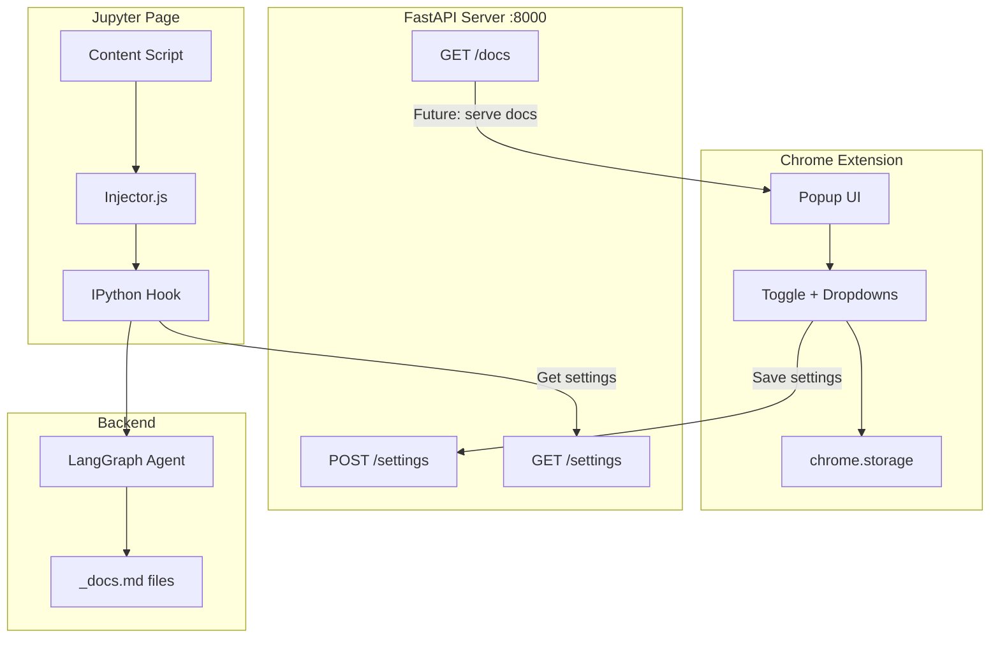

# Phase 2: Chrome Extension + FastAPI Backend

---

## Decisions

| Decision | Choice |
|----------|--------|
| Kernel Restart | Prompt user with Yes/No |
| Settings Scope | Global defaults + per-notebook overrides |
| MVP Dropdowns | Style and Length only |
| Backend | FastAPI server |
| Future | MD viewer in extension |

---

## Architecture



---

## Flow Summary

1. **User toggles ON** → Prompt "Restart kernel?" → Inject hook
2. **User changes Style/Length** → Save to chrome.storage + POST to FastAPI
3. **Cell executes** → Hook GET settings from FastAPI → LangGraph agent uses style/length → Write to `_docs.md`
4. **Future: View docs** → Extension calls GET /docs → Renders markdown

---

## File Structure

```
Notebook_Agent/
├── src/
│   ├── api/                    # [NEW] FastAPI server
│   │   ├── __init__.py
│   │   ├── main.py             # FastAPI app + CORS
│   │   ├── routes/
│   │   │   ├── settings.py     # POST/GET /settings
│   │   │   └── docs.py         # GET /docs
│   │   └── models.py           # Pydantic request/response
│   ├── agent/                  # [MODIFY] Add style/length to prompts
│   ├── config/                 # [MODIFY] Add new settings fields
│   └── ...existing...
│
├── extension/                  # [NEW] Chrome extension
│   ├── manifest.json
│   ├── popup/
│   │   ├── popup.html
│   │   ├── popup.css
│   │   └── popup.js
│   ├── content/
│   │   ├── content.js          # Bridge: extension ↔ page
│   │   └── injector.js         # Page context: register hook
│   ├── background/
│   │   └── service-worker.js
│   └── icons/
```

---

## FastAPI Endpoints

### POST /settings
Save settings for a notebook.
```python
@app.post("/settings")
async def save_settings(req: SettingsRequest):
    # req = { notebook_path, style, length }
    settings_store[req.notebook_path] = req
    return {"status": "saved"}
```

### GET /settings
Get settings for a notebook (falls back to global).
```python
@app.get("/settings")
async def get_settings(notebook: str):
    return settings_store.get(notebook, global_defaults)
```

### GET /docs (Future)
Serve the markdown docs file.
```python
@app.get("/docs")
async def get_docs(notebook: str):
    docs_path = notebook.replace(".ipynb", "_docs.md")
    return {"content": Path(docs_path).read_text()}
```

---

## Extension Manifest (Key Parts)

```json
{
  "manifest_version": 3,
  "permissions": ["storage", "activeTab", "scripting"],
  "host_permissions": [
    "http://localhost:*/*",
    "http://127.0.0.1:*/*"
  ],
  "content_scripts": [{
    "matches": ["http://localhost:*/*"],
    "js": ["content/content.js"]
  }]
}
```

---

## Backend Modifications

### [MODIFY] src/agent/nodes.py

```python
STYLE_PROMPTS = {
    "technical": "Use precise technical terminology.",
    "beginner": "Explain like teaching a beginner.",
    "concise": "Be extremely brief.",
    "detailed": "Thorough explanation with examples.",
    "academic": "Formal academic tone."
}

LENGTH_TOKENS = {"short": 100, "medium": 250, "long": 500}
```

### [MODIFY] src/config/settings.py

```python
explanation_style: str = Field(default="technical")
explanation_length: str = Field(default="medium")
```

---

## Implementation Order

| # | Task | Priority |
|---|------|----------|
| 1 | FastAPI skeleton + CORS | High |
| 2 | Settings endpoints | High |
| 3 | Extension manifest + popup UI | High |
| 4 | Content script + injector | High |
| 5 | Hook reads settings from API | High |
| 6 | Style/length in prompts | Medium |
| 7 | Kernel restart API call | Medium |
| 8 | Polish + error handling | Low |

---

## Dependencies to Add

```txt
# requirements.txt additions
fastapi>=0.109.0
uvicorn>=0.27.0
```

---

## Running Phase 2

```bash
# Terminal 1: FastAPI server
uvicorn src.api.main:app --reload --port 8000

# Terminal 2: Jupyter
jupyter notebook

# Chrome: Install extension from extension/ folder
```
